

  

    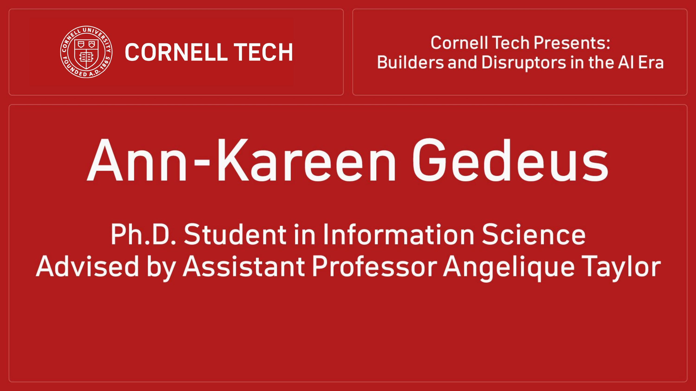
    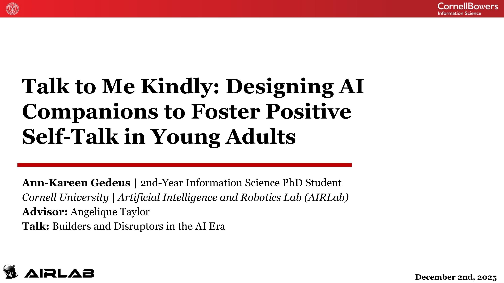
    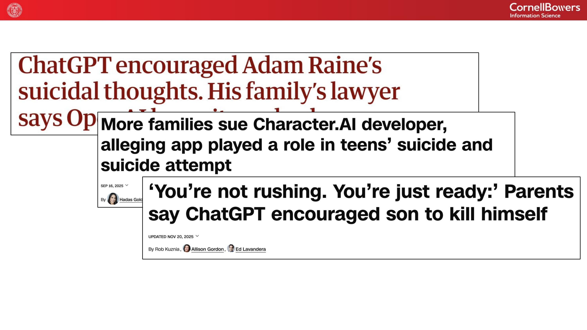
    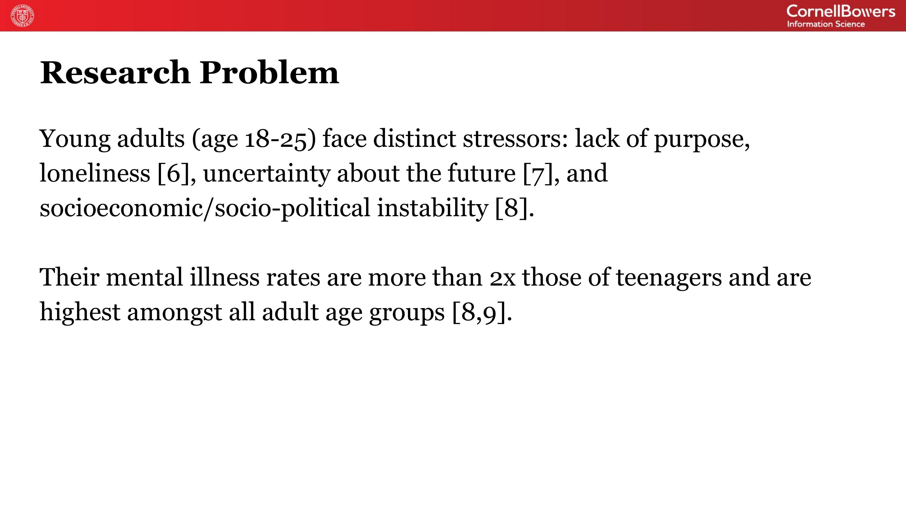
    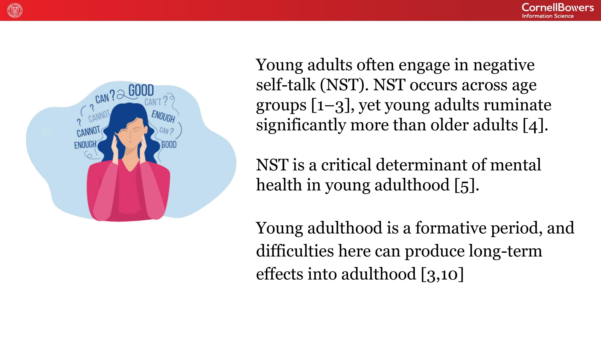
    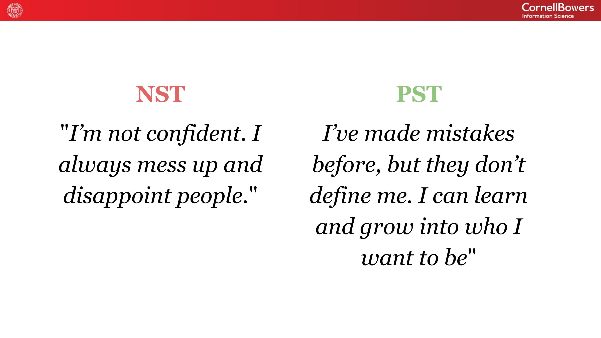
    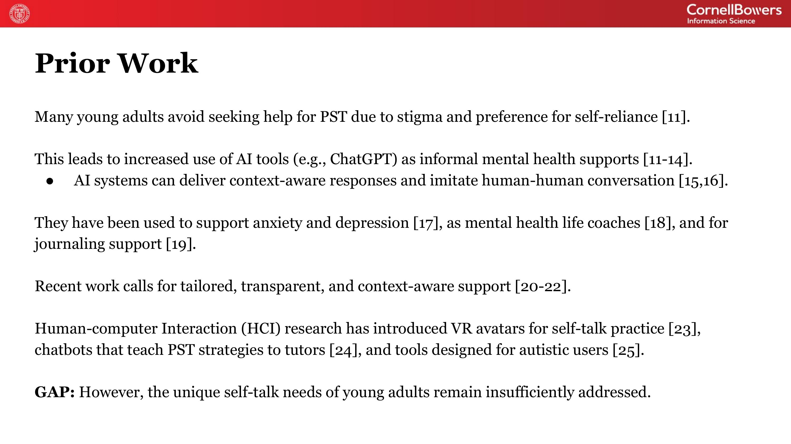
    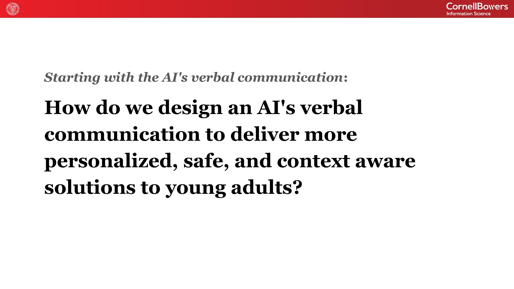
    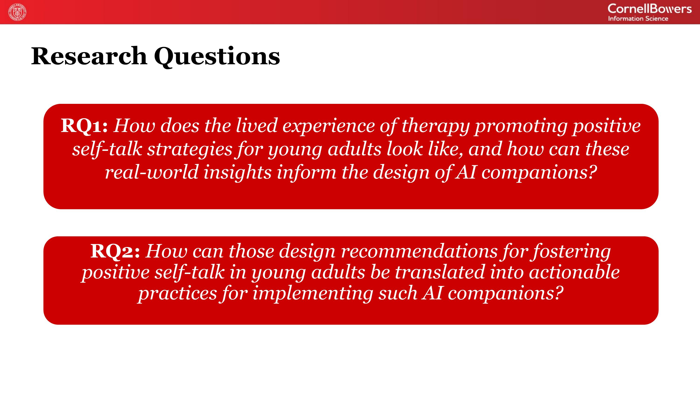
    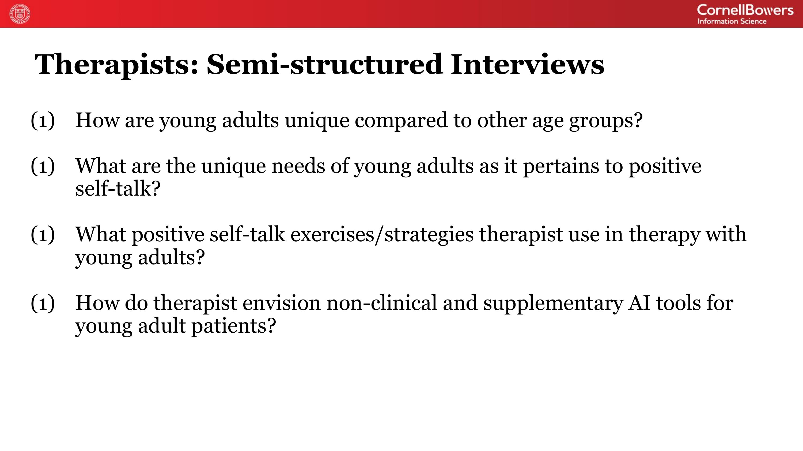
    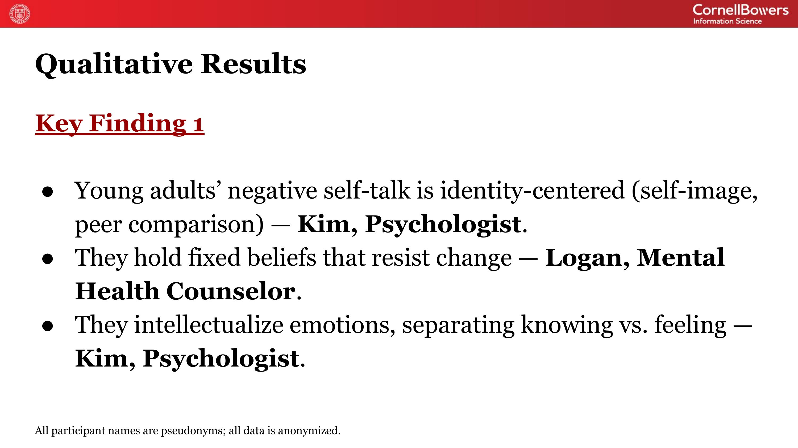
    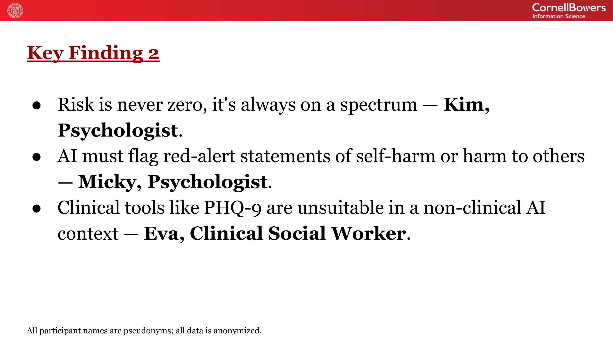
    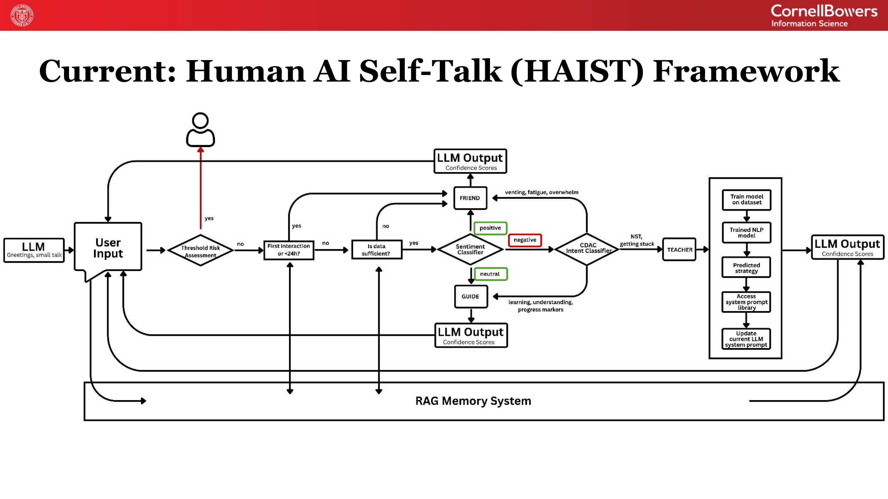
    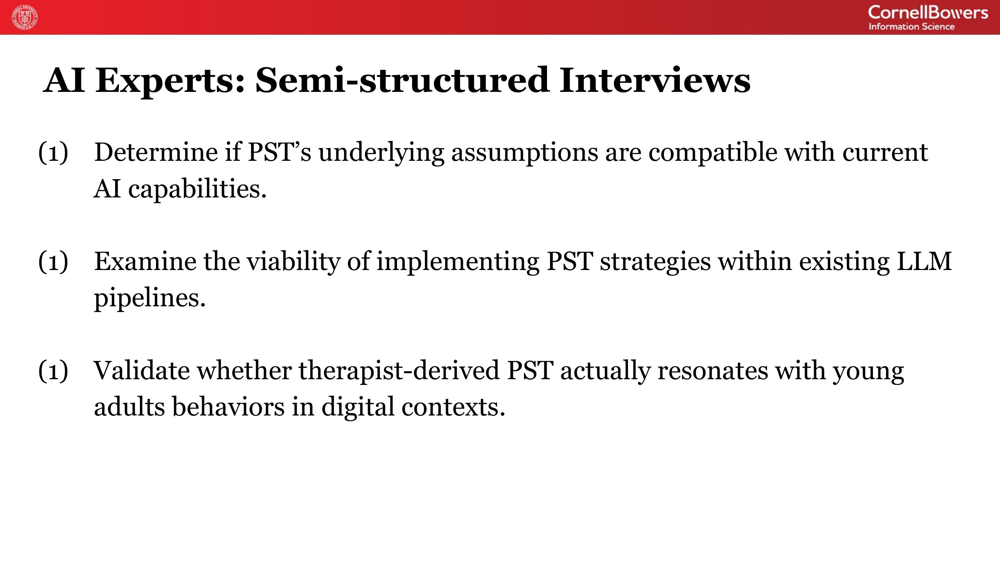
    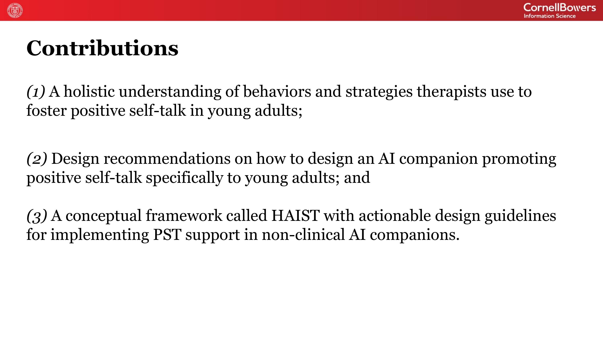
    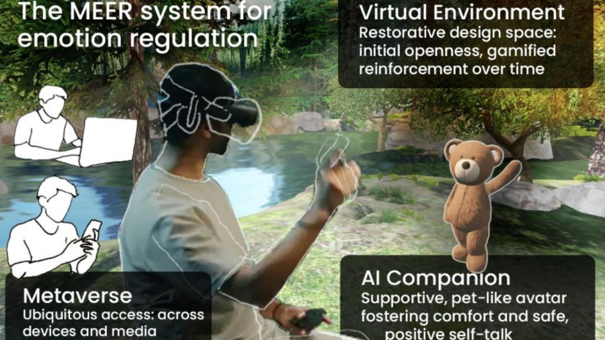
    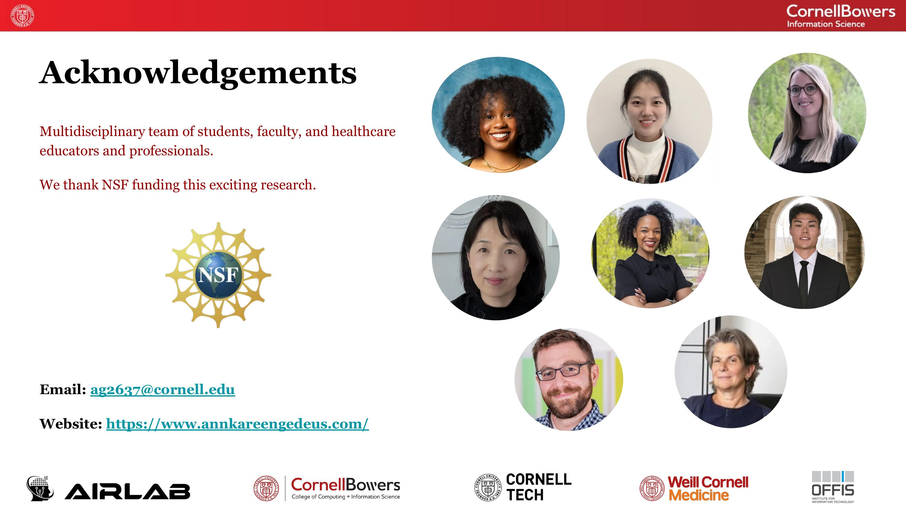
    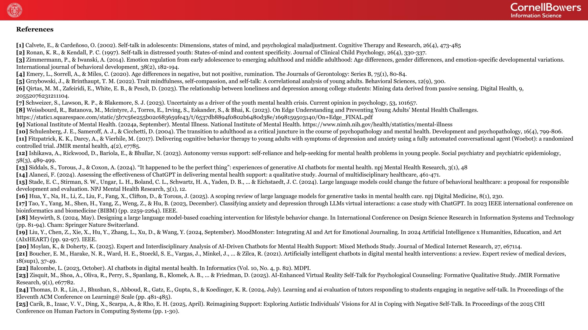
    <button class="slide-carousel-prev" aria-label="Previous slide">&#8249;</button>
    <button class="slide-carousel-next" aria-label="Next slide">&#8250;</button>
  

  
1 / 18

