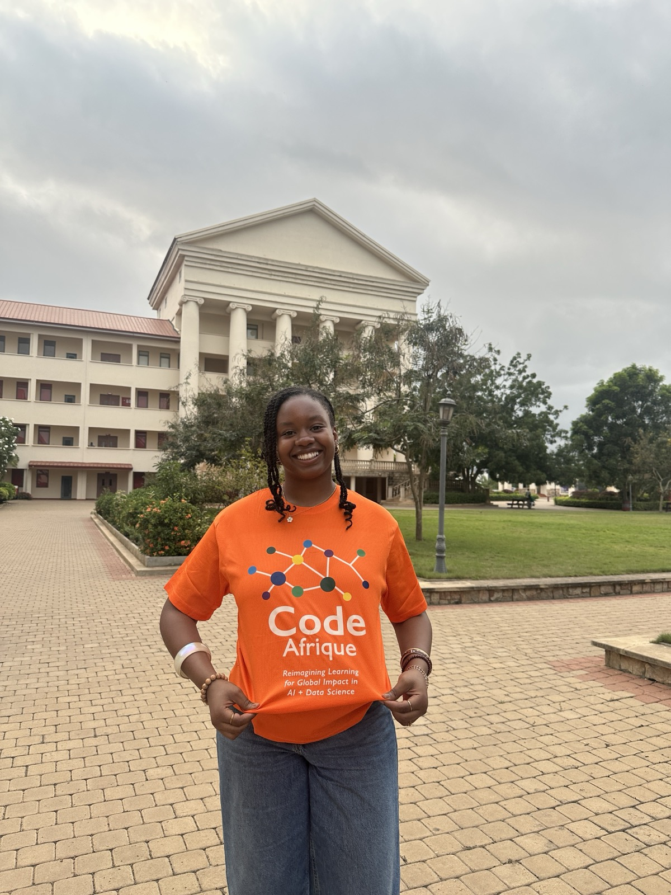
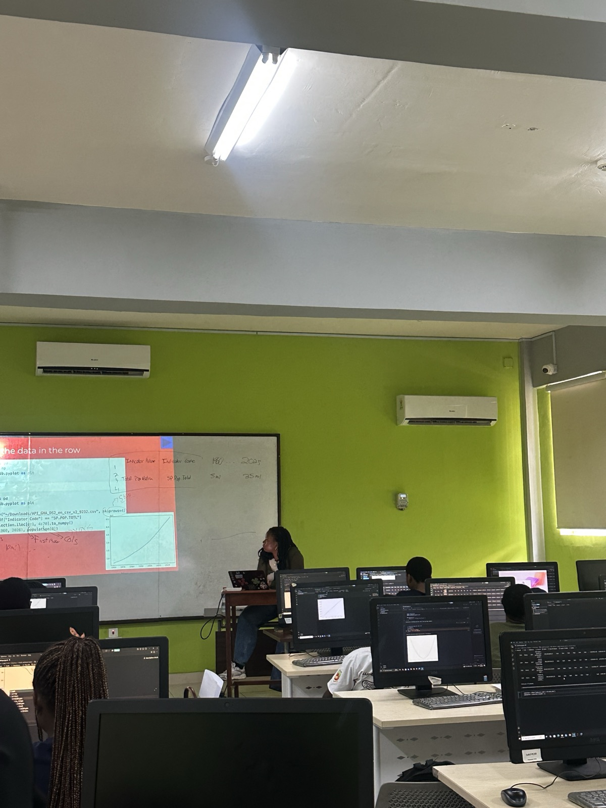
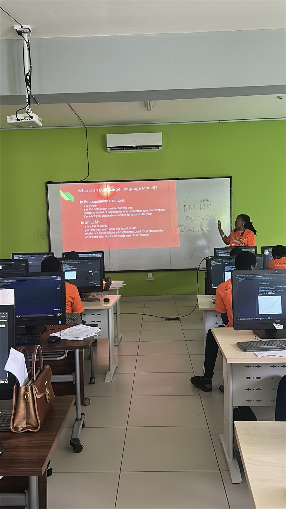
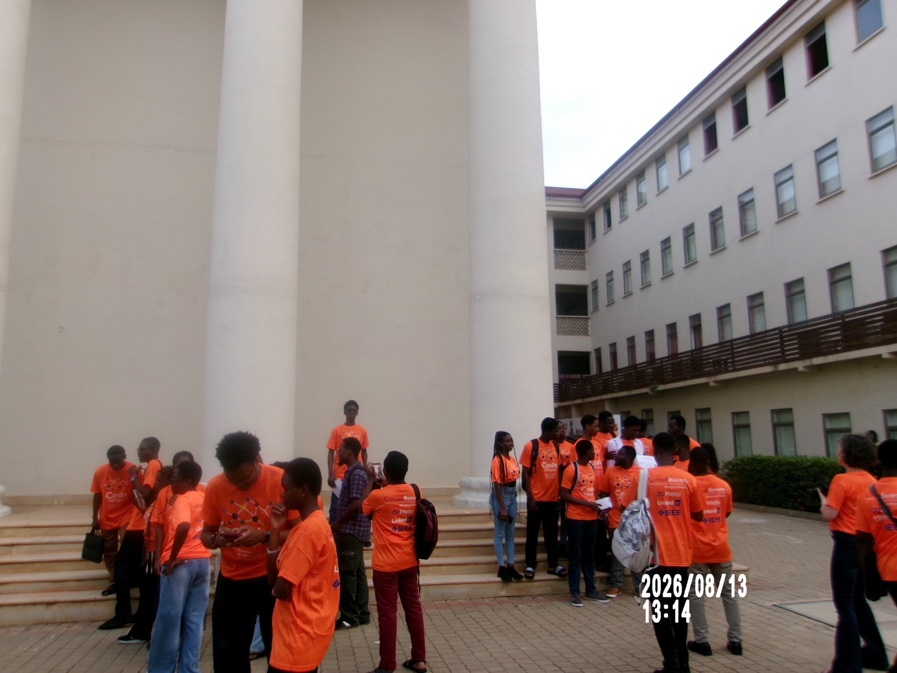
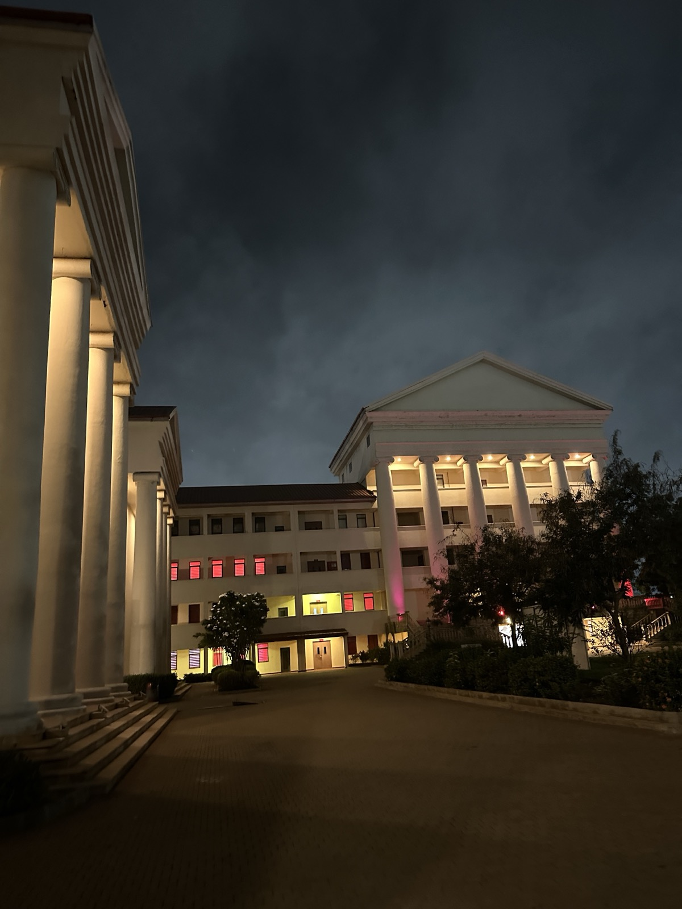

Traveled to Accra, Ghana, to serve as a teaching assistant, mentor, and teacher at Code Afrique 2025, a coding bootcamp hosted at Academic City University by [Code Afrique](https://codeafrique.org/), a nonprofit that gives African science students a window into computer science. Taught Python and data science to K-12 students, August 10-13, 2026.

Students worked hands-on in Python, using pandas and matplotlib to load, clean, and plot real World Bank population data, and we also walked through how large language models work, mapping the ideas back to the regression and modeling concepts from earlier in the week. The cohort worked alongside volunteers and mentors from Cornell Bowers CIS, Meta, LinkedIn, and IEEE.

  

    
    
    
    
    
    <button class="slide-carousel-prev" aria-label="Previous slide">&#8249;</button>
    <button class="slide-carousel-next" aria-label="Next slide">&#8250;</button>
  

  
1 / 5

